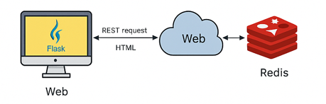

# Succeeded to commit to main branch directly without pull request

Great project!

# 🔮 Daily Horoscope Service

A web-based horoscope service that provides daily readings for zodiac signs.  
It uses **Redis caching** to reduce API requests and is fully containerized with **Docker Compose**.

---

🔍 How It Works

1. User selects a zodiac sign via the web interface or API.
2. The service checks Redis for a cached horoscope for today's date.
3. If not found, it fetches fresh data from the external API.
4. The result is returned and cached for future requests.

---

## 🧠 System Architecture

The system uses Flask (Python) as the backend and Redis as a caching layer.  
Horoscope data is fetched from an external API and cached for 24 hours to improve performance.

 


```
   [User Browser]
         |
         v
   [Flask App (web)]
         |
         v
 [External API] <--> [Redis Cache]
         |
   [Docker Compose manages everything]
```


---

## ✨ Features

- 🖥 Web interface to select and view your zodiac's daily horoscope
- 🔌 RESTful API to fetch horoscope data programmatically
- ⚡ Redis-based caching (per zodiac sign per day)
- 💾 Persistent Redis storage via Docker volumes
- 🐳 Dockerized architecture for easy deployment

---

## 📦 Project Structure

```
horoscope-service/
├── web/
│   ├── app/                # Flask app
│   │   ├── __init__.py     # App factory and Redis setup
│   │   ├── config.py        # Configuration class for environment variables
│   │   ├── routes.py       # HTML & API routes
│   │   ├── horoscope.py    # Logic to call external API and cache in Redis
│   │   ├── static/         # CSS styling
│   │   └── templates/      # HTML pages
│   ├── Dockerfile          # Web service image definition
│   ├── requirements.txt    # Python dependencies
│   └── run.py              # Entry point (used by Gunicorn)
├── redis-data/             # Volume mount for Redis persistence
├── docker-compose.yml      # Orchestration of web & redis
└── README.md               # You're here!
```

---

## 🚀 How to Run

1. **Clone the repository**:
   ```bash
   git clone https://github.com/maayanshemesh/horoscope-service
   cd horoscope-service
   ```

2. **Start the app using Docker Compose**:
   ```bash
   docker-compose up --build
   ```

3. **Open your browser**:
   ```
   http://localhost:5000
   ```

4. **Stop the app**:
   ```bash
   docker-compose down
   ```

---

## 📡 API Usage

### 🔗 Endpoint:
```
GET /api/horoscope/<sign>
```

Replace `<sign>` with one of:  
`aries`, `taurus`, `gemini`, `cancer`, `leo`, `virgo`,  
`libra`, `scorpio`, `sagittarius`, `capricorn`, `aquarius`, `pisces`

### 💡 Example:
```bash
curl http://localhost:5000/api/horoscope/leo
```

### 🔁 Example JSON Response:
```json
{
  "sign": "leo",
  "horoscope": {
    "description": "You may feel inspired today...",
    "date": "2025-05-11"
  }
}
```

---

## 💾 Redis Data Persistence

Redis stores horoscope data in memory and saves it on disk using the `appendonly` option.  
The `redis-data/` directory in this project is mounted as a Docker volume — ensuring that cached data persists even after stopping containers.

---

## 🛠 Development Workflow

If you change the code:

```bash
docker-compose down        # Stop containers
docker-compose up --build  # Rebuild with changes
```

---

## 🧰 Technologies Used

| Component       | Technology           |
|----------------|----------------------|
| Backend         | Flask (Python)       |
| Caching         | Redis                |
| API Source      | External Horoscope API |
| Containerization| Docker, Docker Compose |
| Frontend        | HTML, CSS (Jinja2 Templates) |

---
